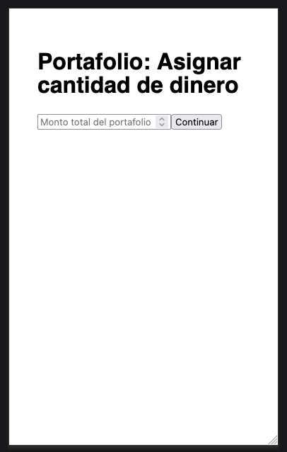
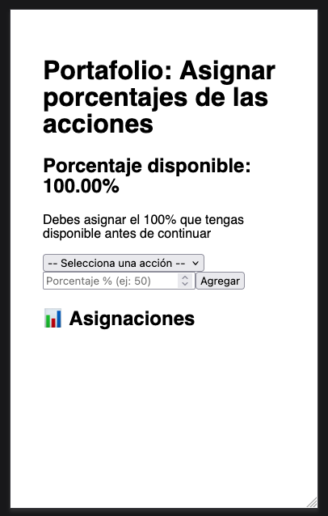
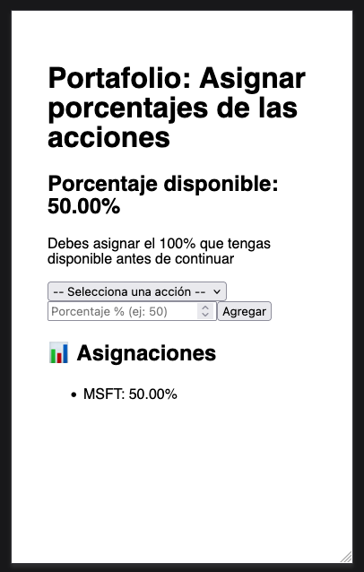
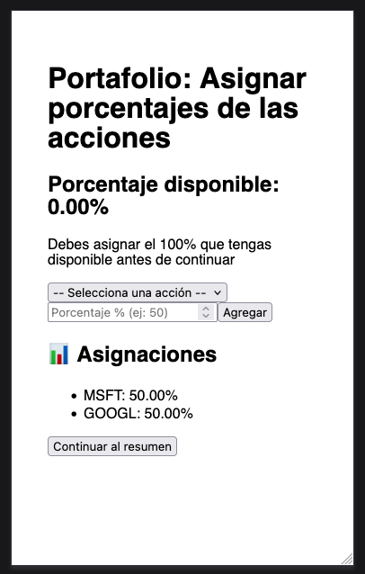
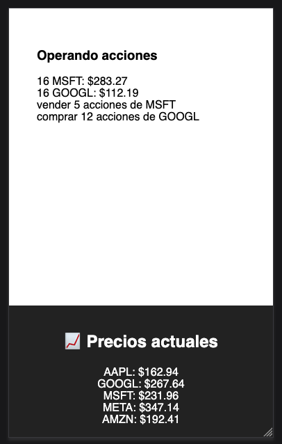
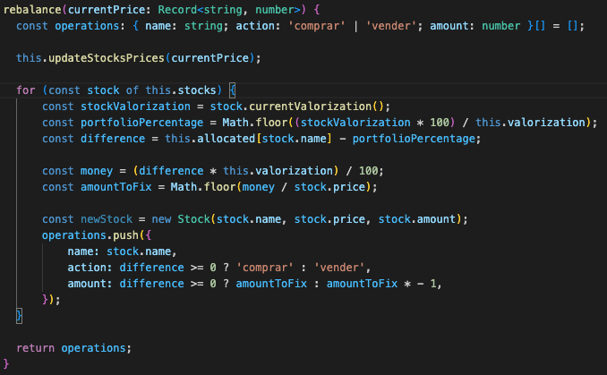

# Instalacion

Para poder revisar este proyecto es necesario el uso de docker. Para levantar el proyecto se debe correr el siguiente comando en una terminal. La terminal debe estar en la carpeta del proyecto.

```docker compose up -d --build```


Luego abrir en un navegador ```localhost:3000```. Para efectos de este desarrollo, no se considero inicio de sesion. 



Luego se deben seleccionar el porcentaje de acciones que debe contener el portafolio.



Se deben seleccionar acciones hasta completar el 100%.



Una vez se seleccione el 100% de las acciones podemos avanzar a la siguiente pagina.



En esta pagina podremos ver el precio que actualmente tiene la accion y lo que debemos hacer para mantener el portafolio con los porcentajes que escogimos en la pantalla anterior. 



En esta pantalla se simula el cambio de precio de las acciones usando de referencia un archivo json que se encuentra dentro de ```src/data/precios_acciones_250s.json```. Usted puede modificar el json para ver el cambio en el precio, pero por motivos de tiempo, las acciones quedaron a fuego en el codigo por lo que para que funcione este desarrollo con su set de datos las acciones deben ser las mismas que se exponen en el json.

La logica mas importante para efectos del problema que se expuso se encuentra en ```src/models/Portfolio.ts``` en la funcion ```rebalance``` que se expone a continuacion.



Para efectos de esta prueba, comenzamos comprando todas las acciones al primer precio del archivo json, esa es nuestra referencia segun el porcentaje que se escogio, luego cada 2 segundo cambiamos el valor de la accion y con ello debemos hacer el calculo necesario de cuanta variacion del porcentaje del portafolio fue afectado con el cambio de precio. Para hacer el calculo lo primero que hacemos es a nuestras acciones actualizar el precio, una vez que todas las acciones son actualizadas procedemos a obtener la valorizacion del portafolio, con esto podemos obtener el porcentaje actual de la accion en nuestro portafolio y desde ahi comparar con el porcentaje esperado (el que fue seleccionado en la segunda pagina), si nuestra diferencia es positiva, quiere decir que el porcentaje actual de la accion en nuestro portafolio es menor a lo esperado, por ende, debemos comprar. Analogamente, si la diferencia es negativa, debemos vender.